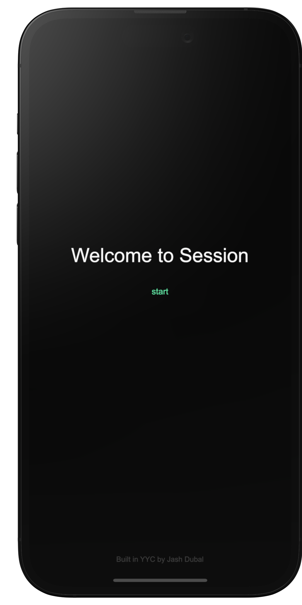
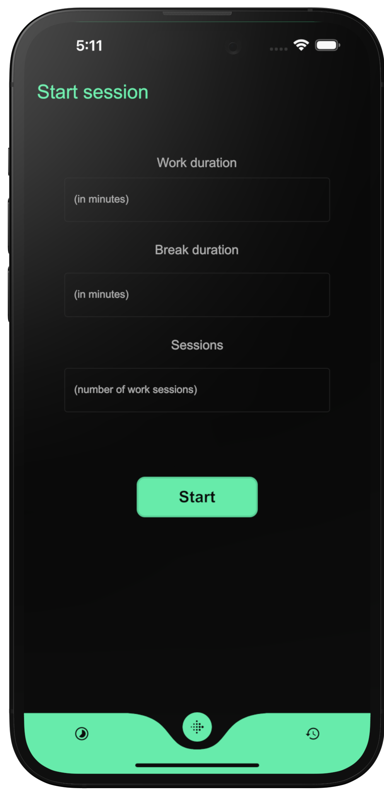
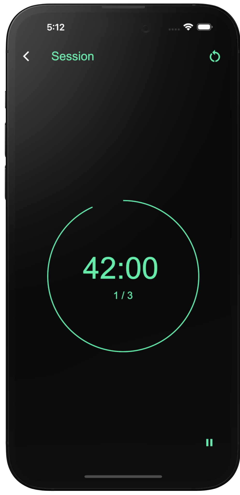
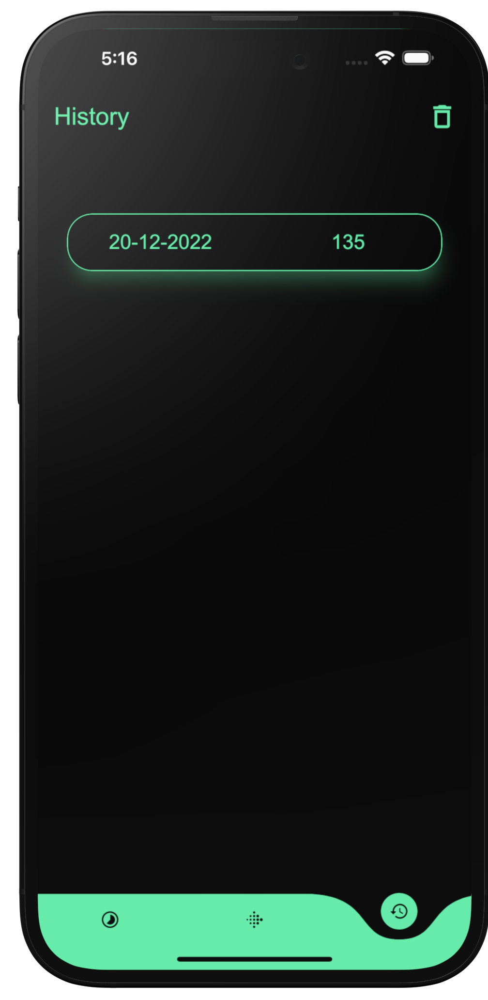
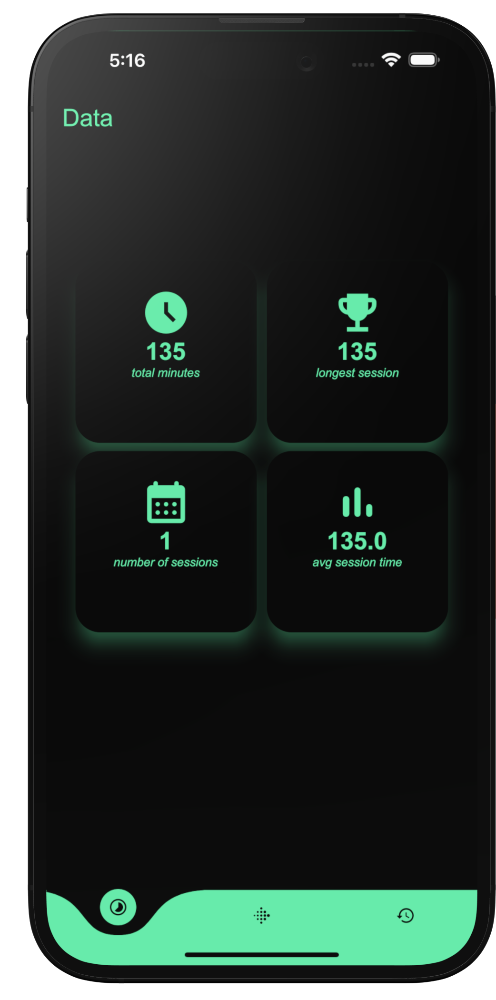

# Session

Session is a cross-platform app that helps users track work sessions using the Pomodoro Technique. It was built using Flutter and Dart, and uses Flutter's state management features to store data without the need for a database. This makes it a lightweight and efficient tool for staying focused and organized.

## 🎬 Showcase

| Welcome | Home | Session |
| ------------------ | --------------------------- | ------------------ |
|   |  |  |

| History | Data |
| ------------------ | --------------------------- |
|   |  |

## 🚀 Future Development

In the future, I plan to add advanced data visualization features such as heat maps and enhanced statistics, as well as increased customizability for the timer, including the ability to remove breaks. Stay tuned!
